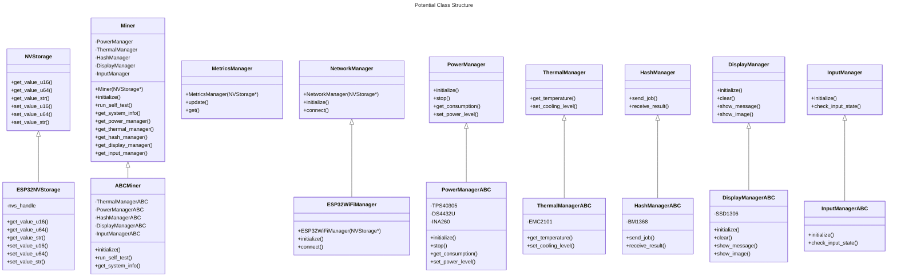

## Overview
This is an initial set of ideas for a refactor of ESP-Miner, with the goal of facilitating many miner/board variants integrating with ESP-Miner. A refactor can help scale ESP-Miner to support larger numbers of mining device types (think dozens to hundreds or more), with minimal impact to the functionality/stability of different devices, and enabling desiners to minimize the amount of code they need to create/maintain.

### Platform
At least initially, the thought is to keep using ESP32, specifically esp32s3, and whenever practical keep design microcontroller agnostic to facilitate potential future porting.
FreeRTOS would still be used for now. An interesting alternative for further investigation could be Zephyr.

### Approach
- Migrate existing hardware-specific implementation from `main` to `components`, to organize hardware-agnostic and hardware-specific code.
- Develop sufficient, yet generic, interfaces with implementation in `components`. The application in `main`, including Tasks, would ideally have very limited hardware-specific knowledge and rely on the agreed-upon interfaces to conduct operations involving hardware
  - Example: A non-volatile storage interface, modeling a generic key/value store provides a means for the application in `main` to obtain and store parameters without knowledge of the specific ESP-IDF library calls. This enables alternative non-volatile storage with minimal to no changes to the `main` application (e.g. use of an external eeprom, etc.)
- Prioritize usage of the DRY principle as much as possible to maximize code re-use in new mining devices (e.g. reusable classes for common parts)
- Opportunistically create additional unit tests and increase the robustness of existing unit tests. This will increase confidence in the implementation and help catch regressions
- Encapsulate significant aspects of the mining device
  - Example: A Hash Manager that receives jobs, dispatches them to ASIC hardware, and receives result. Knowledge of the specific ASIC(s) used is implementation hidden behind the interface
  - Example: A Thermal Manager that allows for checking the current thermal condition of the device, and the adjusting cooling system
  - Example: A Display Manager that manages communication with a graphical display
- Distribute split and assign members of global state to the respective manager classes

### Language
Migration to C++ enables object-oriented features such as inheritance and polymorphism, which facilitate modularity using familiar language features.
FreeRTOS is C-focused, so current concept/thought would be for Task functions to leverage `extern "C"`.
There may be some limitations (e.g. exception handling), so most C++ classes created may need to avoid exceptions usage when possible.

As an alternative, could implement object-oriented stylized C (https://stackoverflow.com/a/8194632/26342368,  https://stackoverflow.com/a/415536/26342368) with vtables and structs. A rough initial idea/example is available in this [branch](https://github.com/tdb3/ESP-Miner/tree/c_intfc_example).

#### Preliminary Class Structure
This is only a preliminary class structure, and would need to be further refined. This assumes usage of C++, but might be roughly modeled in C with emulation of an object-oriented approach.


##### NVStorage
Abstract interface for non-volatile storage, modeling a generic key/value store.  Provides a means to obtain and store parameters without knowledge of the specific storage implementation.

##### ESP32NVStorage
Implements the NVStorage interface for ESP32 specific non-volatile storage.

##### MetricsManager
Keeps track of mining related metrics (e.g. current hashrate, efficiency, best difficulty, etc.). Some of this could possibly be absorbed into other classes (e.g. HashManager).

##### ThermalManager
An abstract interface for managing the mining device's cooling system based on the temperature of the mining device. The interface is purposefully generic such that differences in implementation are managed internally by children implementing the interface (e.g. fans of different speed, fluid pumps, fanless designs, etc).

##### PowerManager
An abstract interface for managing board-level power delivery (including to hash devices). For example, voltage regulators/controllers, monitoring of power consumption, etc. The interface is purposefully generic such that differences in implementation are managed internally by children implementing the interface (e.g. different voltages, etc).

##### NetworkManager
An abstract interface for different types of network connections. While non-WiFi interfaces are not currently anticipated, this interface may provide a generic way for variants to use an alternate network interface types (e.g. Ethernet, cellular, LoRa, etc.)

##### ESP32WiFiManager
Manages ESP32's WiFi (e.g. connection to SSID, AP mode, etc.)

##### HashManager
An abstract interface for receiving mining jobs, dispatching them to ASIC hardware, and receiving result. Knowledge of the specific ASIC(s) is contained in children implementing the interface. Could manage multiple ASIC devices.

##### DisplayManager
An abstract interface for providing information to a graphical display. Knowledge of the specific display(s) is contained in children implementing the interface.

##### InputManager
An abstract interface for receiving user input (e.g. from buttons). Details of input controls are managed by children implementing the interace.

### Options for Firmware Unification
Some initial thoughts exploring a unified firware image (esp-miner.bin) to support many mining devices. A hypothetical example device, ABCMiner is used in the discussion.

Using non-volatile storage to determine, at runtime, which type of mining device is being used with the firmware has the advantage of enabling a single firmware build to support a range of devices (assuming those devices all are esp32-based). For example, multiple Bitaxe devices and ABCMiner might use the same firmware image.

A downside is that as the number of supported mining devices grows, more and more code may need to be linked, so the firmware image could grow in size to a point where it outgrows its available partition space. This does not appear to be scalable in the long run.

An alternative approach would be to set a compile-time option (e.g. `-D MINING_DEVICE=ABCMiner`) to select the mining device for which the firmware image is being built. While this isn't ideal for firmware image distribution (users would need to download/use the appropriate firmware for their device), it does seem more scalable in the long run. The risk of users accidentally installing the wrong firmware image could potentially be mitigated by performing prechecks on the image before installation, denying installation of an inappropriate firmware image for the device.

#### Initialization
A Factory could be used to create the appropriate `Miner` child class.
Example:
```c++
std::shared_ptr<Miner> g_miner;
...
ESP_LOGI(TAG, "Instantiating Miner");
g_miner = create_miner(g_nvs);
if (!g_miner) {
    ESP_LOGE(TAG, "Unable to instantiate the mining device");
    exit(2);
}
```
If using runtime-based device selection, this could be determined from NVStorage parameters. If using compile-time device selection, the Factory function could include appropriate preprocessor conditionals.

Example:
```c++
std::shared_ptr<Miner> create_miner(std::shared_ptr<NVStorage> nvs) {
    std::shared_ptr<Miner> ret;
    #if ABC_MINER
        ret.reset(new ABCMiner(nvs));
    #elif OTHER_MINER
        ret.reset(new OtherMiner(nvs));
    #endif

    return ret; 
}
```

The constructor/initialize functions of ABCMiner would instantiate and initialize the specific Manager classes.
Each Manager class would instantiate the specific device objects (e.g. BM1368).

In CMakeLists.txt, can add something like the following to set a MINING_DEVICE string at build time.

```
if(MINING_DEVICE STREQUAL "ABCMiner")
    message(STATUS "Building for ABCMiner")
    add_compile_definitions(ABC_MINER)
elseif(MINING_DEVICE STREQUAL "Bitaxe_Supra")
...
```

When building:
```
idf.py build -D MINING_DEVICE=ABCMiner
```

A combination of runtime and compile-time approaches could potentially be implemented, where multiple hardware revisions of a device share the same firmware build, and nvs is used to determine specifically which hardware to use.

### Unit Tests
ESP32 uses the Unity C unit test framework.
Ideally unit tests would be built only when explicitly creating a test build. This way there is no vestigial test object code bloating normal release builds (microcontroller flash is a scarce resource).

If using C, Unity is straightforward to work with. When using C++, it appears there are some nuances through which to navigate.

An initial approach (albeit hacky), testing C++ classes in C unit test files:
- Create a typical C unit test file (using Unity), e.g. `components/foo/test/test_foo.c`
- Create a `TEST_CASE()` for the functionality being tested, e.g. `TEST_CASE("testing foo", "[foo]")`
- Create a C++ header file (e.g. `TestFoo.h`) with a corresponding test function, which returns an error code (`int`), and wrap it with `extern "C"`
    TestFoo.h:
    ```c++
    #ifndef TEST_FOO_H
    #define TEST_FOO_H
    
    #ifdef __cplusplus
    extern "C"
    {
    #endif
    
    int test_foo();
    
    #ifdef __cplusplus
    }
    #endif
    
    #endif
    ```
- Create the definition of this function in the corresponding `TestFoo.cpp`. Add `#include` statements to the cpp as necessary to include the appropriate C++ classes to test
    TestFoo.cpp
    ```c++
    #include "TestFoo.h"
    #include "Foo.h"
    
    int test_foo() {
        Foo f;
        if (f.do_some_action() == 42) {
            return 0;
        } else {
            return -1;
        }
    }
    ```
- Exercise the appropriate class functionality within the test function
- Include the header for the test function (e.g. `#include "TestFoo.h"`) in the C unit test file and call the test function within `TEST_CASE`, e.g.
    ```c
    #include "TestFoo.h"
    
    TEST_CASE("test foo", "[foo]")
    {
        TEST_ASSERT_EQUAL(test_foo(), 0);
    }
    ```

Other thoughts:
- Create a `Test` version of a class being tested (e.g. `components/thing/TestThing.cpp`), which is a child of the class to be tested (e.g. `Thing`, including the appropriate header `Thing.h` within the cpp). Use the technique above to create a C test function linkable and callable from `TEST_CASE()`, including `TestThing.h` in the cpp of the wrapper so it can be used by the test function. 
- Overload functions of the class that would otherwise depend on usage of specific hardware.

#### Simple extensibility example
A designer creates a modified ABCMiner, called ABCMinerPaper, with a Waveshare 12955 E-Ink display instead of an SSD1306 display.
The designer would create `ABCMinerPaper`, a child class of `ABCMiner`.
The designer would also create `DisplayManagerABCMinerPaper`, a child class of `DisplayManagerABCMiner`.
`DisplayManagerABCMinerPaper` contains an `EInk12955` object to handle communication with the alternate display.
The implemented `show_message()` uses `EInk12955` rather than `SSD1306`.
The constructor/init() of `ABCMinerPaper` could instantiate/initialize the same Manager classes as `ABCMiner`, with the exception that `DisplayManagerABCMinerPaper` is created instead of `DisplayManagerABCMiner`.
Tasks use the interface declared by `DisplayManager`, so they are effectively unaware of the change.

### Other draft notes/thoughts
- The Axe-OS web interface is somewhat specific to Bitaxe devices, but could potentially be adjusted to accommodate other types of mining devices. `Miner` could provide `get_system_info()` to provide http_server's system info route with a means to generically provide system info to the web interface. The web interface would need to be updated to show different system info, or choose to display info categories/types common to all devices (e.g. temperature)
- Some components may "blur the lines". For example, EMC2101 performs fan control, but also services as a temperature monitor.
